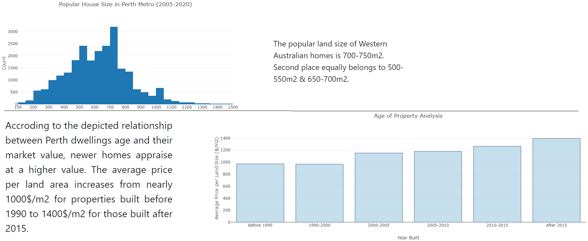
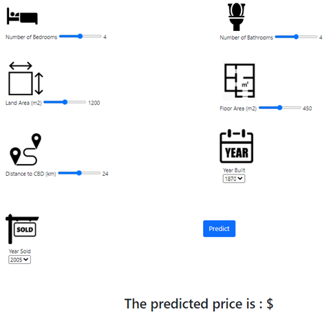
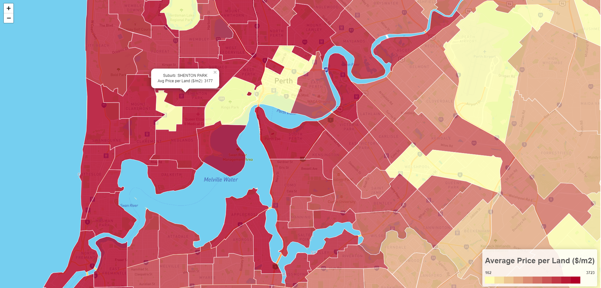

# Forecasting Perth Housing Prices using Machine Learning Algorithm

In this project, supervised machine learning regression algorithms are employed to find a model that is functional in predicting house prices in Perth metro area. 

The training and testing data consist of over 25,000 records in csv format with key features including number of bedrooms, bathrooms, land area, floor area, build year, distance to CBD, train station and schools.

For this, an online valuation tool is developed to identify how much a house is worth.

## Task

1. Data visualisation is prepared to indocate how the price of Perth dwellings are affected by features such as land size, year sold, house age, distance to CBD and distance to school.

2. Machine learning algorithms are used to predict the required budget to buy a property through indication of some property features including the number of bedrooms, number of bathrooms, distance to CBD, land area and build year.

3. Choropleth map of the average price of properties at different Perth suburbs is provided.

The outcome app of this analysis is shared and deployed on Heroku.

https://perthhousingforcast.herokuapp.com/
